# SnapFood: An Online Food Delivery System

## Introduction
  #### In this project, we will develop an Online Food Delivery System using Python, highlighting the implementation and advantages of both linear and non-linear data structures. The system allows users to order food from various restaurants conveniently. 
  #### The ONLINE FOOD DELIVERY SYSTEM assumes effective use of linear and non- linear data structures to manage orders and menu searches. By using queues and tries, we aim to provide a balanced and efficient platform for both restaurant owners and customers. The chosen data structures are integral to the system&#39;s performance, ensuring fair order processing and quick access to menu items.
  
## Team Member

  | Name of Member          | Assigned Task             | 
  | ----------              | --------------            |
  | Marc Owen Palma         | Web UI Design             | 
  | Ivy Jean Rivera         | Web UI Design             | 
  | Justin Rebaton          | Web UI Content            |
  | John Vladimir Abantao   | Web UI Content            |
  | Jelly Well B. Batara    | Back-End                  |
  | Karyl May C. Visico     | Front-End                 | 
  | Rheden N. Padilla       | Documentation and Report  | 
  | Troy Angelo P. Castillo | Documentation             | 

  
## Software Requirements
  ### Language
  | Language  | Percentage | Functions and Decription |
  | ----------| -----------|--------------------------|
  | HTML      | 45.6 %     | Backbone of web pages. It structures content, creating the skeleton of SnapFood Website.  |
  | CSS       | 43.9%      | Adds style and visual appeal to your HTML elements. |
  | JavaScript| 6.4%   | Brings interactivity and dynamic behavior to your website.| 
  | Python    | 4.1%       | Handles server-side logic and data processing on database. |
  
## Implementation
  ### Key Algorithms
  1. #### **Queue**
     #### To handle incoming food orders efficiently, we use a queue. The queue ensures that orders are processed on a first-come, first-served basis. This linear structure is simple and   helps maintain order fairness, ensuring customers receive their food in the sequence they ordered.
  
  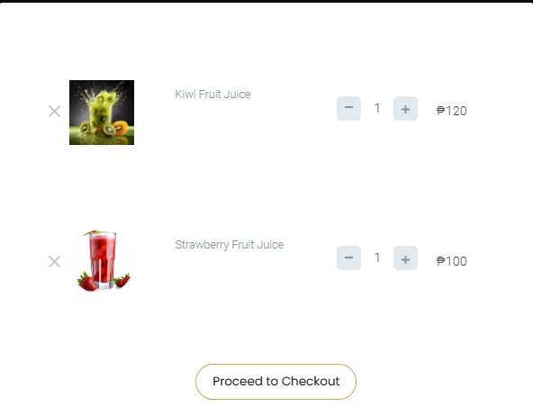  
  
  2. #### **Prefix Tree (Trie)**
     #### For menu management and item searches, we will implement a trie (prefix tree). This non-linear structure allows for quick and efficient searches, making it easy for users to find menu items based on prefixes. The trie structure organizes menu items in a way that reduces search time, enhancing the user experience.
  
  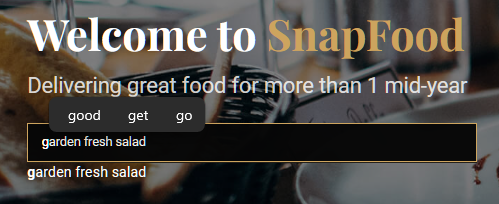
## Documentation
  ### System Interface
  #### 1. Login Page
  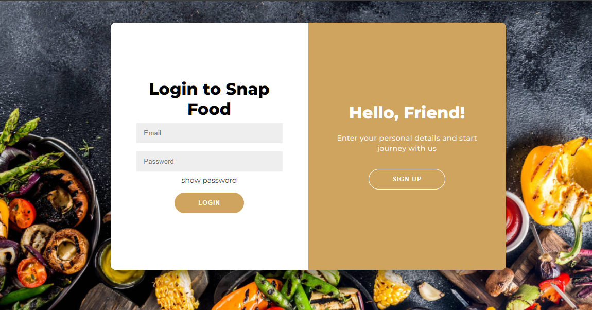
  #### 2. Sign-Up Page 
  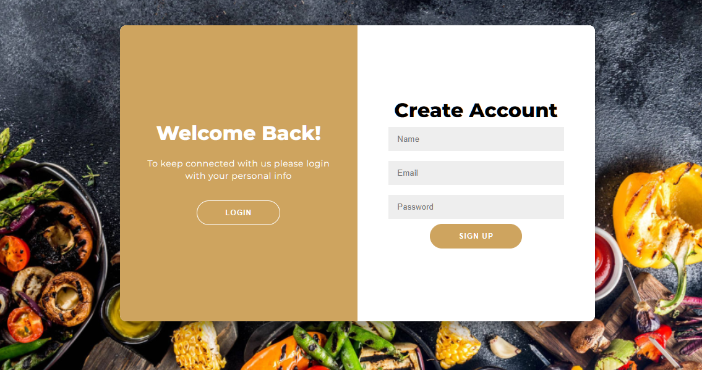
  #### 3. Home Page 
  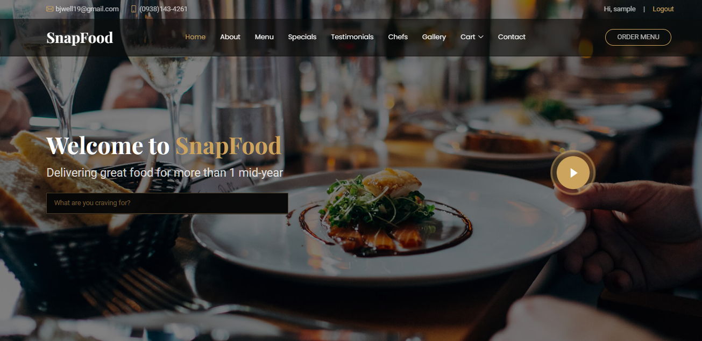
  #### 4. About Page 
  
  #### 5. Menu Page 
  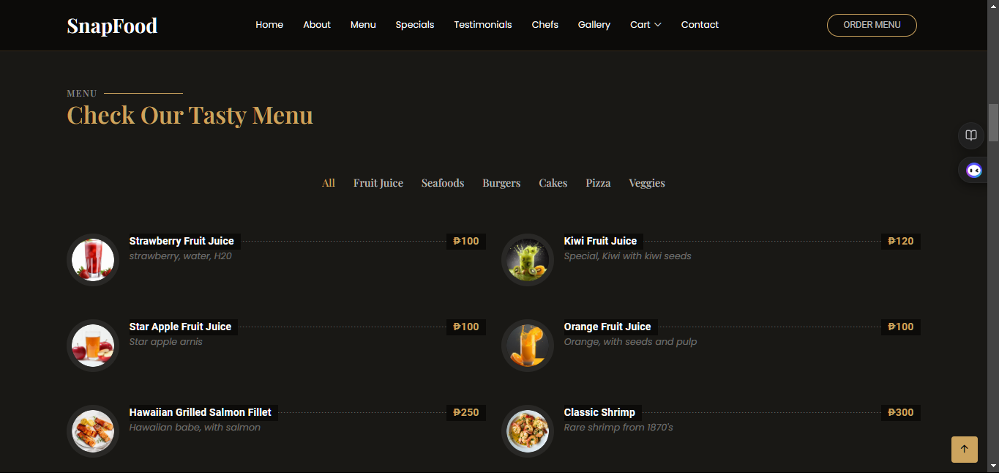
  #### 6. Specials Page 
  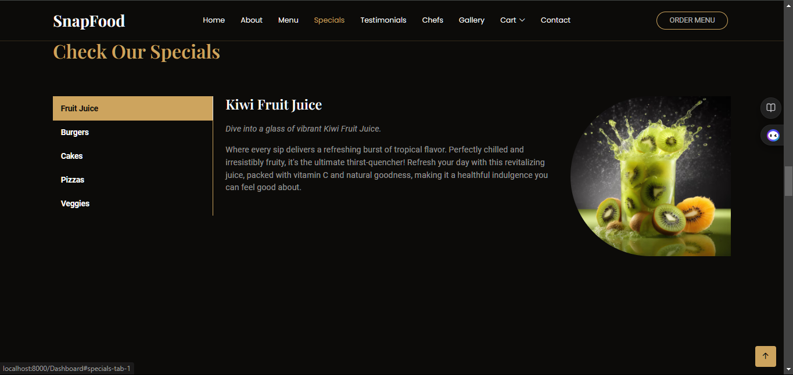
  #### 7. Testimonials Page 
  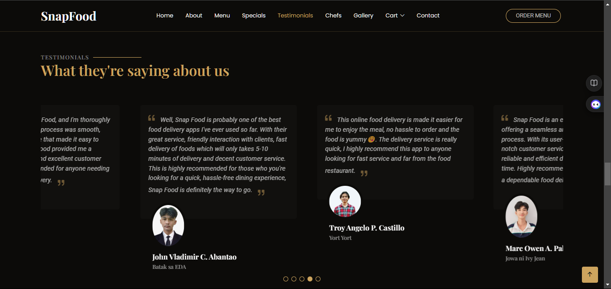
  #### 8. Chefs Page 
  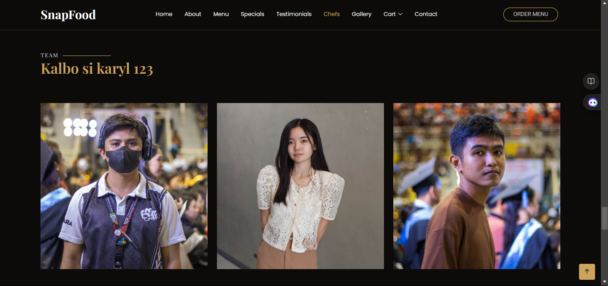
  #### 9. Gallery Page 
  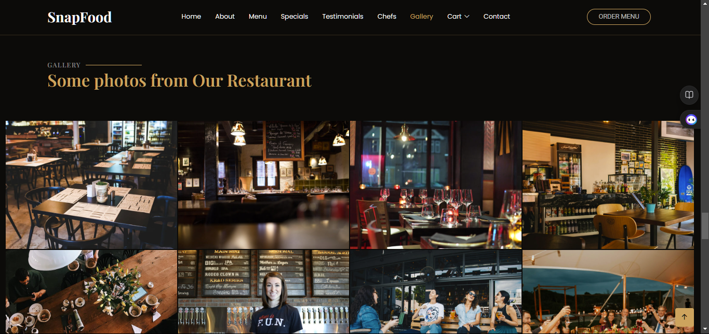
  #### 10. Cart Page 
  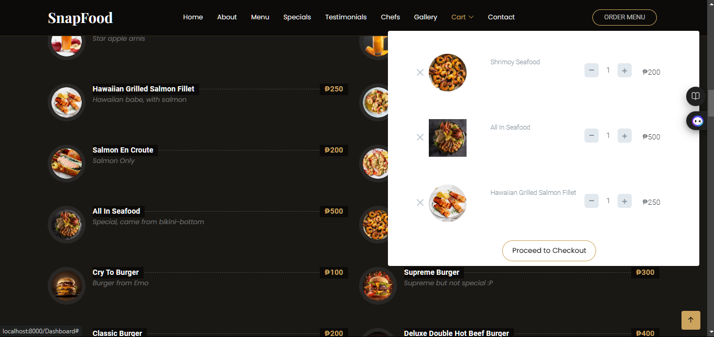
  #### 11. Contact Page 
  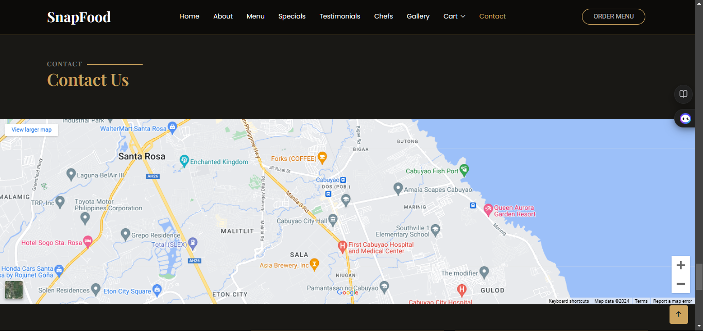

